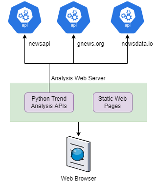

# Trend Analysis using news articles

## Introduction
The idea of this project is to find trends in the market and business. Many times it is important to evaluate the market situation in just few sentences to get the high level idea of whether the market was positive or negative on the selected date. 
This particular exercise targets the same use case using LDA (Latent Dirichlet Analysis) for topic modelling.

## Team
**TeamAnand** is a solo participant and has implemented the entire project alone.

## Functional Design

The functionality includes mainly two components. 
1. A backend component which fetched data and runs topics modelling algorithm.
2. Frontend component used to show the results

### High level design


### News providers 
This project depends on fetching the news articles from three different sources as listed in above diagram. 
1. newsapi.org
2. gnews.org
3. newsdata.io

News from these three sources are fetched over REST APIs and processed using python code which does the topic modelling to identify top trending topics.

### Algorithm
Here the LDAModel is used to fetch top topics from the list of news document corpus. Below steps are followed in order to fetch the topics
1. Convert sentences of news articles to words
2. Using bigram language model to extract phrases
3. Remove stopwords using ntlk
4. Lemmatize the nouns, adjectives verbs and adverbs
5. Prepare the LDA model on lemmatized data to model topics
6. Extract top trending topics from the algorithm

### Webserver
Flask is used as a webserver which has two REST endpoints mainly
1. GET /news - This is a main endpoint which accepts date and returns the top trending topics along with the news articles
2. POST /relevance - This endpoint accepts feedback from the user

POST /relevance endpoint is only used to submit the relevance feedback at this time and to use the feedback into providing more relevant news articles is not in a current scope of the project.
Additionally, the webserver also serves static React pages.

### UI
UI is developed using simple react application. Data table is used to visualize the news articles and builtin functions are used to make REST calls.

## Scope
Below describes exact scope of this project and implementation

### In scope
1. Read news articles using REST endpoint for three news providers (providers given above)
2. Apply topic modelling on collected news articles data from above listed providers 
3. Show top topics and the news articles for given date
4.  Collect relevance feedback from user and submit to server

### Future improvements
Below items are not in the scope of this project and will be considered as extension to the current implementation 
1. Read additional details for the specific news from the actual source site and enhance the topic modelling algorithm
2. Process relevance feedback to finetune the news and topic extraction
3. Show trends for news older than 1 month. This is not possible due to the subscription limitation from the news providers
4. News from newsdata.io. The limitation on the free license doesn't allow fetching the news from history. 

## Technology and functionality
The algorithm is developed with two components. 

A server side python code and client side javascript single page application. Python code on server has three main tasks -
### Python
1. Connect to third party news vendors website such as NewsAPI, GNews and NewsData and fetch content based on date selection.
2. Apply LDA on the fetched news articles and extracts top topics.
3. Serve content of topic modeled over REST API using flask on python
4. Receive relevance feedback

On Javascript side, below tasks are done-
### Javascript (React)
1. The React application renders the webpage as single page application.
2. Based on date selection, fetches top topics as well as the content of all news article on that date.
3. Based on user's relevance selection, submit the relevance feedback to server

## System requirements
This application can be executed on Windows or Linux. 

### Software list
Code is tested on below versions - 
1. python  3.10
2. nodejs v16.15.0

## Installation instructions

Run below commands to install all required packages for this project execution-

```shell
# In case if the script is being run in Ubuntu/Linux, enable below line. This is required in order to install pattern.
sudo apt install default-libmysqlclient-dev
pip install -r ./backend/requirements.txt
cd frontend && npm install
npm run build
cd .. # go back to the project root directory
```

First command installs all python libraries. The description of all libraries is given in libraries section.
We also need to install spacy language pack download with below command-

```shell
python3 -m spacy download en_core_web_sm
```

## Run the project
After following the installation instructions, continue with this section in order to run the application.

```shell
cd backend
python3 ./app.py
```

Additional finding on Windows is the python version 3.10 needs to be referred as **python**. So the respective changes needs to be done in commands at both sides.

Above commands should run the python flask webserver and the URL http://localhost:5000 should be available to open on the browser.

The project also contains the **oneClickRun-linux.sh** and **oneClickRun-windows.ps1** file which should help run the entire application just by executing one file.

Open the browser UI and select any date from the near past. browser should fetch the top topics along with the articles for that date.


## Libraries

Python code runs on server side and requires below packages-
1. gensim - For LDA and related functions implementation
2. spacy - For lemmatization of words
3. flask - Python based webserver
4. pattern - This is being used for mining patterns
5. nltk - Natural language toolkit. Helpful as natural language utility

Mainly React uses below packages-
1. react-spinners
2. react-data-table-component

## Steps and time required
Below are the required tasks and respective time spent on the activities

1. API layer preparation for all three sources - 5 hours
2. Setup Flask Webserver to receive requests from UI - 1 hour
3. Prepare API on python webserver -
	a. Take date as input and respond with relevant articles trending that day with top trends - 1 hour
	b. Receive feedback on articles from user and use it as a validation - 30 minutes
4. Algorithm of LDA end to end implementation - 5 hours
5. Prepare React based UI to show a page which will call API and show top trending articles - 5 hours
6. Documentation and presentation - 5 hours

## References
https://towardsdatascience.com/topic-modelling-in-python-with-spacy-and-gensim-dc8f7748bdbf
